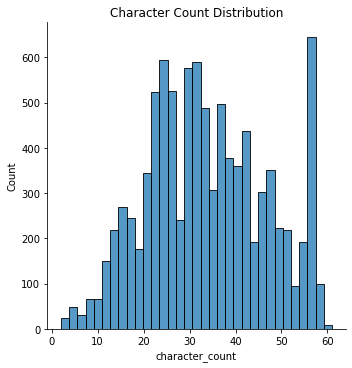

# Using NLP for text classification of Beyonce and Rihanna lyrics
-[The Problem](#Problem-Statement)
I've decided to build a topic classification model that can classify the artist based on the lyrics.  
-[Background](# Background)
I pulled in lyrics for 75 of the most popular songs for each artist (according to Genius) via the Genius API. 

-[Data[(#Data) 

To assess the basic characteristis of each line of their lyrics, I conducted the following four text analysis for both artists together & individually:

Goals + data source: I built a topic classification model using 75 of their most popular songs, each according to Genius. For this iteration I excluded remixes + other artists songs they were featured in.
My primary goal was for this model to correctly predict which artist the lyrics belong to when fed a line from their lyrics. 
And my secondary goal was  to deploy the highest scoring model on Streamlit. 

After creating an API client + adapting some code from the Genius team + John Miller (the creator of the LyricsGenius python package), I was able to use the Genius API to extract about 9600 lines of lyrics. Luckily there were only about 148 observations I had to drop because they were just weird space holders within some lines of the lyrics. 

-[Observations](#Observations)

So now let’s dive into the EDA. To start we’re going to look at EDA I did on the entire dataset, then we’re going to look at EDA comparing these 2 artists.
Dataset EDA:
- To assess the basic characteristics of these lyrics, I conducted the following 3 text analysis:
    - Word count which gives you the sum of words for each line. As you can see here the distribution ranges from 1 to 16 words, with most lines containing between 5-7 words. 
    - Unique word count  gives you the sum of unique words & as you can see here, the distribution ranges from 1 to 15, with most lines containing between 5-7 unique words
    - Lexical richness gives you insight into how varied the vocabulary is in each line, so the sum of unique words / by the sum of word count. The higher the lexical richness, the higher the nuance + punctuation usage in their lyrics. This ranges from 35-100%. Overall, these artists have nuance in their lyrics.
Now let’s compares these 2 artists 
- Word count looks about the same for both artists
    - Beyonce’s lines of lyrics range from 1-16  words, with most between 4.5-6 words
    - Rihanna’s lines range from 1-14, with most between 5-7
    
   
    
    
    
    
- Unique word count looks about the same for both artists as well
    - Beyonce’s unique word usage range from 1-15, with most around 5-7
    - Rihanna’s ranges from 1-13, with most around 5-7 also
- Lexical richness is where I see the most difference between their lyrics.
    - What I see here is that Rihanna’s lyrics have more nuance than Beyonce’s. 

Modeling - I played around with these 4 models, with both the tfidf and count vectorizers. The models scored higher with the count vectorizer and removing the stop words didn’t make a big difference. All of these models did pretty well with exceeding the baseline score of 52. Accuracy in this context is the proportion of accurate classifications of these 2 artists with their lyrics + specificity is the proportion of lyrics that were misclassified to the wrong artist. I think the specificity score in this case speaks to how similar their lyrics generally are.

I decided to deploy the support vector machine model to streamlit & with that said let’s quickly check out how it performs - http://localhost:8501/

So here I have a list of the 150 songs that the models were trained on. This model defaults to Beyonce when there are no lyrics entered so let’s enter a line from Rihanna.
	- Rihanna lyric: "So how come when I reach out my fingers"

And now let’s enter a line from Beyonce:
- Beyonce lyrics: "She walked in the club like nobody's business"

Observations - I’m not a music expert by any means but Beyonce & Rihanna appear to have similar writing styles + perhaps they work with some of the same song writers + influenced by JayZ

Conclusion/next steps
* Train model on their entire catalogue, including features & remixes

* Conducting a Sentimental Analysis would be cool, to get a deeper understanding of their work 

* Build a neural network version of this classifier

* NLP is constantly + rapidly evolving so I’m sure there’s so much more I can do in future iterations of this project

-[Modeling](#Modeling)
Logistic Regression:
Naives Bayes:
Random Forest:
Support Vector Machine:

-[Observations](#Observations)
I’m not a music expert by any means but Beyonce & Rihanna appear to have similar writing styles and perhaps they work with some of the same song writers. Not to mention both have a professional relationship with JayZ.

-[Future Iterations](#Future-iterations)
Conduct a Sentiment analysis to classify the artists based on the emotional context of the lyrics.
I do acknowledge their lyrical style might change so I will consider checking all 4 classification metrics.
Train model on their entire catalogue, including features and remixes.
Conducting a Sentimental analysis would be cool, to get a deeper understanding of their work.
Build a neural network version of this classifier.
NLP is rapidly evolving so I'm sure there's tons more I can do in future iterations of this project.

-[Sources](#Sources)
Special thanks to Caroline Schmitt, Noelle Brown, Riley Dallas, Kai Zhao, Heather Robbins & Dan Wilhem!
Write up on Genius API - https://towardsdatascience.com/song-lyrics-genius-api-dcc2819c29 

